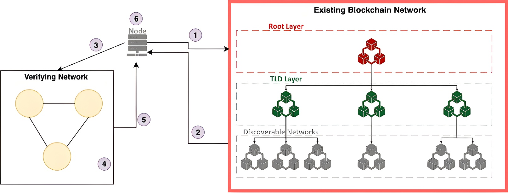

# Blockchain Discovery Verification Protocol

The main purpose of this side project is to support the verification process of the discovery mechanism using zero knowledge proof. Main goal:

- Ensuring that the client is able to connect to the existing blockchain network without having to worry about any malicious node and/or data.

## Data Verification Protocol

The verification process adheres to the following 5 steps:

1. [Domain Resolution Protocol](../README.md)

2. Once the Domain Resolution Protocol completes, the existing blockchain network returns the specifications needed for the client to connect to the target network. [Sample result example.com here](./utils/sample_result.json)

3. To verify whether the returned data is correct, the client must connect to the BootNodes and fetch the information they contain. But, to avoid centralization, the client will create a verifying network consisting of n nodes, where each node connects to the BootNode independently.

4. Each node in the verifying network will perform a consensus vote based on the information received from the BootNode. Nodes will broadcast their results to one another, and each node will independently perform consensus and send its result back to the client.

5. The client will collect all results from the verifying network and accept the value that received the highest number of votes.

6. After deciding on the most agreed-upon result, the client will perform a final verification of the BootNode data using zero-knowledge proof.
